  

   

  
  
  
  

 

## `>_ SYSTEM_INIT: INTRODUCTION`

Bem-vindo ao meu repositório de estudos. Este é o log central da minha jornada para atingir o nível **God Mode** em desenvolvimento Front-End. Aqui, código não é apenas escrito, é arquitetado.

> *"Talk is cheap. Show me the code."*

---

## `>_ MODULES: THE STACK`

  

---

## `>_ ROADMAP: EXECUTION PLAN`

```mermaid
graph TD;
    A[🏁 START] --> B(HTML5 & Semantic Web);
    B --> C(CSS3 & Responsive Design);
    C --> D{JAVASCRIPT};
    D -->|Basic| E[Logic & DOM];
    D -->|Advanced| F[ES6+ & Async];
    F --> G[TYPESCRIPT];
    G --> H{FRAMEWORKS};
    H --> I[React & Next.js];
    H --> J[Vue.js];
    H --> K[Angular];
    I --> L[DEPLOY & OPTIMIZATION];
    L --> M[🏆 FRONT-END MASTER];
    style A fill:#000,stroke:#8A2BE2,stroke-width:2px,color:#fff
    style M fill:#8A2BE2,stroke:#fff,stroke-width:2px,color:#fff

```

### 🟣 `[LVL 1] FOUNDATIONS`

* [ ] **HTML5:** Semântica, Acessibilidade, SEO.
* [ ] **CSS3:** Flexbox, Grid, Animations, Variables.
* [ ] **JavaScript:** DOM Manipulation, Events, Fetch API.
* [ ] **TypeScript:** Types, Interfaces, Generics.

### 🟣 `[LVL 2] FRAMEWORKS & ECOSYSTEM`

* [ ] **React:** Hooks, Context, State Management (Zustand/Context API).
* [ ] **Next.js:** SSR, SSG, Routing, Server Actions.
* [ ] **Architecture:** Clean Code, SOLID Principles, Component Patterns.
* [ ] **Styling:** Tailwind CSS, Shadcn/UI, Styled Components.

---

## `>_ ARSENAL: TACTICAL LOADOUT`

Recursos organizados por setor para máxima eficiência no desenvolvimento.

### 🛠️ SECTOR 01: UI ENGINEERING (Componentes & CSS)

| WEAPON | DESCRIPTION |
| --- | --- |
| **[Shadcn/UI](https://ui.shadcn.com/)** | *Meta atual.* Componentes acessíveis e customizáveis (Copy/Paste). |
| **[Tailwind UI](https://tailwindui.com/)** | Componentes oficiais do Tailwind (Refêrencia Gold). |
| **[HyperUI](https://www.hyperui.dev/)** | Componentes Tailwind Open Source gratuitos. |
| **[CVA](https://cva.style/)** | Class Variance Authority (Essencial para criar variantes de botões). |

### 💎 SECTOR 02: VISUAL INTELLIGENCE (Assets)

| WEAPON | DESCRIPTION |
| --- | --- |
| **[Phosphor Icons](https://phosphoricons.com/)** | Ícones perfeitos para React (Família completa). |
| **[Lucide](https://lucide.dev/)** | A biblioteca de ícones mais leve e moderna atualmente. |
| **[Realtime Colors](https://realtimecolors.com/)** | Visualize paletas em um site real antes de escolher. |
| **[Fontshare](https://www.fontshare.com/)** | Fontes gratuitas de altíssima qualidade (melhor que Google Fonts). |
| **[MagicPatterns](https://www.magicpattern.design/tools/css-backgrounds)** | Gerador de backgrounds CSS complexos. |

### ⚡ SECTOR 03: KINETIC SYSTEMS (Animação)

| WEAPON | DESCRIPTION |
| --- | --- |
| **[Framer Motion](https://www.framer.com/motion/)** | A *Bazuca* das animações em React. |
| **[AutoAnimate](https://auto-animate.formkit.com/)** | Adicione animação a listas com 1 linha de código. |
| **[GSAP](https://greensock.com/gsap/)** | O padrão da indústria para animações complexas na web. |

### 🧠 SECTOR 04: LOGIC & DATA CORE

| WEAPON | DESCRIPTION |
| --- | --- |
| **[Zustand](https://github.com/pmndrs/zustand)** | Gerenciamento de estado 100x mais simples que Redux. |
| **[TanStack Query](https://tanstack.com/query/latest)** | O jeito *certo* de fazer requisições (Cache, Revalidate). |
| **[Zod](https://zod.dev/)** | Validação de dados (Schema Validation) TypeScript-first. |
| **[React Hook Form](https://react-hook-form.com/)** | Formulários performáticos sem re-render desnecessário. |

### 🔧 SECTOR 05: DEV-OPS & UTILS

| WEAPON | DESCRIPTION |
| --- | --- |
| **[Omatsuri](https://omatsuri.app/)** | Canivete suíço: Gerador de CSS, Svg compressor, fake data. |
| **[Transform.tools](https://transform.tools/)** | Converte JSON p/ TS, CSS p/ Tailwind, HTML p/ JSX. |
| **[Bundlephobia](https://bundlephobia.com/)** | Verifica o peso de uma lib antes de instalar (Evite bloatware). |
| **[Regex101](https://regex101.com/)** | Debugger de Expressões Regulares. |

### ⚔️ BATTLEGROUNDS (Locais de Treino)

* **[Frontend Mentor](https://www.frontendmentor.io/)** (Cenários Reais)
* **[Codewars](https://www.codewars.com/)** (Lógica Pura)
* **[BigFrontend.dev](https://bigfrontend.dev/)** (Entrevistas Front-End específicas)

---

## `>_ ANALYTICS: DATA STREAM`

---

👾 <i>Code like a hacker, build like an artist.</i> 👾

Copyright © 2025-Present - <a href="https://github.com/dev-kauams">Kauã Mariano Santinho</a>

